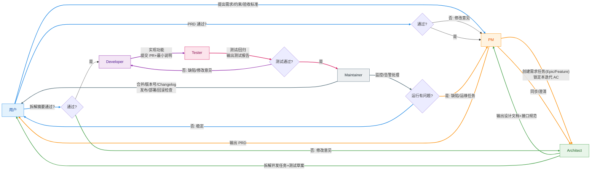

## 简介

用一套最小可用的“AI 开发团队”协作流，把用户从“提出需求”到“交付可运行、可维护的工程”的过程标准化。

- 用户只需要通过通讯软件提出需求、审阅阶段性产物，并决定继续或修改
- 团队最终交付：可运行、可部署、可维护的 Git 工程（含说明文档）

## Input（用户提供）

- 部署环境与配置选择（本地/云端、依赖、密钥、资源限制等）
- 功能需求与验收标准
- 迭代过程中的反馈与修改意见

## Output（团队交付）

- 可运行、可部署的 Git 工程
- 文档：运行说明、部署说明、功能说明（含已知限制/FAQ）
- 可追踪的变更记录（PR / 版本号 / Changelog）

## 角色与职责

| 角色 | 职能 | 核心技能 |
| --- | --- | --- |
| PM（项目经理） | 接收需求；澄清范围与验收标准；拆解里程碑与任务；同步进度与风险 | 需求分析、沟通、任务拆解 |
| Architect（架构师） | 技术选型与系统设计；输出/维护设计文档；发起设计评审；将设计拆成可实现的开发任务；在任务完成后回写设计 | 系统设计、接口规范、可维护性 |
| Developer（开发） | 周期性查看任务板并领取任务；实现功能；提交 PR 并发起代码评审；产出最小可用说明；触发测试任务 | 工程实现、代码质量、协作（PR） |
| Tester（测试） | 制定测试策略与用例；执行测试/回归；记录缺陷并推动修复；更新任务状态与验收结论 | 测试设计、自动化/回归、质量门禁 |
| Maintainer（维护） | 监控已部署工程的健康状态；处理告警；发布运行状态；推动问题复盘与改进 | 运维/可观测性、稳定性 |

## 挑战（待解决）

1. **任务粒度**：设计任务与开发任务过大，会导致 PR review 困难；过小则沟通与切换成本过高。需要一套机制保证任务原子性与可版本化。
2. **评审与反馈闭环**：设计评审、代码评审、测试验收需要形成统一的“通过/不通过 + 修改意见”的闭环。
3. **交付可运行性**：每个迭代结束都需要可运行的版本（可本地一键启动或可部署），避免“只交付代码片段”。
4. 工作环境初始化：不同的工程决定了生产环境和技能

## 工作流

目标：把“需求 → 设计 → 开发 → 测试 → 发布/维护”的闭环做成可重复的最小流程；每一步都有明确产物、评审点和回退路径。

### 0. 入口与约束（用户 → PM）

- 输入：部署环境/约束（本地或云端、密钥、资源限制）、功能需求、验收标准
- 输出：需求卡片（Problem/Scope/Out of scope/AC/风险与假设）

### 1. PRD（PM）

- 产物：PRD（范围、用户故事、验收标准、非功能需求、里程碑）
- 评审点：用户确认（通过/不通过 + 修改意见，可跳过但默认建议一次确认）
- 通过后：创建“需求任务”（Epic/Feature 级别）并锁定本迭代 AC

### 2. 设计与拆解（Architect）

- 产物：设计文档（架构图、关键流程、数据模型、接口规范、边界与失败策略）
- 产物：任务拆解（可合并的、可 review 的开发任务 + 测试任务草案）
- 评审点：用户/PM 确认“拆解摘要”（通过/不通过 + 修改意见，可跳过）
- 通过后：开发任务进入任务板，标注依赖与验收条目

### 3. 实现与代码评审（Developer）

- 规则：每个任务必须可独立合并（小 PR、可回滚、含最小说明）
- 产物：代码 + 运行/配置说明（README 更新）+ PR
- 评审点：代码评审（通过/不通过 + 修改意见，可跳过但默认建议）
- 通过后：触发测试任务（或更新测试任务状态为“可测”）

### 4. 测试与验收（Tester）

- 产物：测试用例/策略、测试报告、缺陷单（关联到具体 PR/任务）
- 评审点：测试结论（通过/不通过 + 修改意见）
- 通过后：合并代码并更新变更记录（Changelog/版本号）

### 5. 发布与维护（Maintainer）

- 产物：部署说明/发布记录、健康检查项、监控与告警（最小可用）
- 评审点：发布检查（可运行/可部署/可回滚）
- 运行中问题：进入缺陷/运维任务，并在迭代复盘中沉淀改进项

### 流程图（Mermaid）

