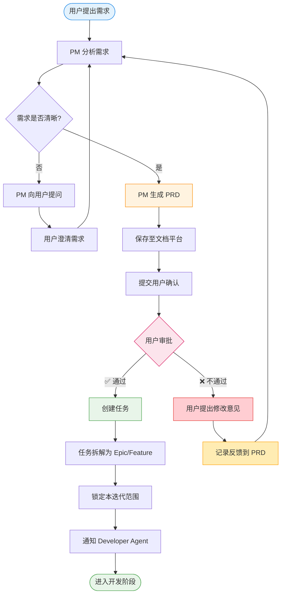

# ClawFleet

> 通过学习和实践智能体工作流（Agentic Workflow），构建多智能体协作系统。

## 项目目标

学习和交流**智能体工作流（Agentic Workflow）**的核心概念与实践方法，通过搭建一个最小可用的多智能体开发团队（Manager + Developer），掌握：

- 智能体的身份定义（Identity）与行为准则（Soul）
- 多智能体之间的任务流转与协作机制
- 基于 Docker 的智能体部署与运行

## 智能体流（Agentic Workflow）

### 定义

**智能体流（Agentic Workflow）** 是一种系统设计范式：通过编排多个具备独立决策能力的智能体（Agent），让它们按照预定义的流程相互协作、自我纠正，共同完成复杂任务。

### 核心特征

1. **分布式决策** — 每个智能体具有独立的判断和执行能力
2. **协作执行** — 智能体之间通过消息传递进行协作
3. **工作流编排** — 定义任务流转、依赖关系和执行顺序
4. **动态适应** — 根据环境和反馈动态调整执行策略

### 吴恩达教授的观点

> "I think AI agentic workflows will drive massive AI progress this year — perhaps even more than the next generation of foundation models."
>
> — Andrew Ng, 2024

吴恩达教授指出，智能体工作流是 AI 的新范式。它不仅仅是单个模型的能力问题，而是如何通过系统化的流程设计，让智能体能够相互协作、自我纠正和不断优化。

📺 **推荐视频**：[What's next for AI agentic workflows - Andrew Ng](https://www.youtube.com/watch?v=sal78ACtGTc)

## PM 智能体工作流

以下是 Manager Agent 的完整工作流程，包含用户审批通过和不通过两条路径：



## 项目结构

```
ClawFleet/
├── docker-compose.yml          # 多容器编排
├── .env.example                # 环境变量模板
├── TESTING.md                  # 测试与验证指南
├── agents/                     # 容器定义 + 独立环境变量
│   ├── manager/
│   │   ├── Dockerfile          # Manager 镜像
│   │   ├── entrypoint.sh       # 两阶段初始化脚本
│   │   └── .env                # Manager 专属环境变量（git ignored）
│   └── developer/
│       ├── Dockerfile
│       ├── entrypoint.sh
│       └── .env                # Developer 专属环境变量（git ignored）
├── data/                       # 运行时数据（volume 挂载）
│   ├── .openclaw/              # OpenClaw 运行时配置（git ignored）
│   ├── agents/
│   │   ├── manager/            # Manager 的 IDENTITY.md / SOUL.md / agent.yaml
│   │   └── developer/          # Developer 的 IDENTITY.md / SOUL.md / agent.yaml
│   └── workspace/              # 共享工作空间（SOUL.md / USER.md / AGENTS.md 等）
└── doc/                        # 设计与参考文档
    ├── design/                 # 架构设计
    ├── integration/            # 第三方集成指南
    └── questions/              # 问题讨论
```

## 快速开始

```bash
# 1. 克隆项目
git clone <repo-url> && cd ClawFleet

# 2. 为每个 Agent 配置环境变量
cp .env.example agents/manager/.env
cp .env.example agents/developer/.env
# 编辑各自的 .env，填入 OPENAI_API_KEY、OPENCLAW_GATEWAY_TOKEN 和 Slack Token

# 3. 启动 Manager
docker compose up manager --build -d

# 4. 查看日志
docker compose logs -f manager

# 5. 验证服务
curl -fsS http://localhost:3001/healthz && echo " ✅ healthy"

# 6. 打开 Canvas UI
open "http://localhost:3001/#token=clawfleet-dev-token-2026"

# 7. 启动 Developer（可选）
docker compose up developer --build -d
```

详细测试步骤请参阅 [TESTING.md](./TESTING.md)。

## 文档索引

| 文档 | 说明 |
|------|------|
| [TESTING.md](./TESTING.md) | 测试与验证指南 |
| [DevelopmentFleet.md](./doc/design/DevelopmentFleet.md) | 开发团队设计与工作流 |
| [PMFlow.md](./doc/design/PMFlow.md) | PM 智能体工作流设计 |
| [PMFlow-Diagrams.md](./doc/design/PMFlow-Diagrams.md) | 工作流程图（Mermaid） |
| [proposal_1.md](./doc/proposal_1.md) | 项目提案 |
| [openclaw-docker.md](./doc/openclaw-docker.md) | OpenClaw Docker 文档解读 |
| [notion.md](./doc/integration/notion.md) | Notion 集成配置 |
| [github.md](./doc/integration/github.md) | GitHub 集成配置 |

## 学习资源

- 📺 [What's next for AI agentic workflows - Andrew Ng](https://www.youtube.com/watch?v=sal78ACtGTc)
- 📺 [Building Agentic RAG with LlamaIndex - DeepLearning.AI](https://www.deeplearning.ai/short-courses/)
- 📖 [OpenClaw 官方文档](https://docs.openclaw.ai)

## 许可证

本项目采用开放协议，欢迎学习、分享与改进。

---

**最后更新**: 2026年3月15日

*学习无止境，流动不停息。让我们一起探索智能体工作流的无限可能！*
