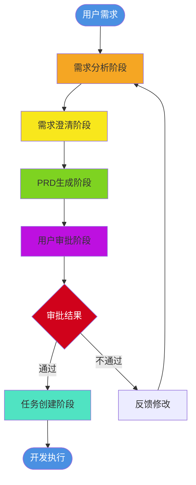
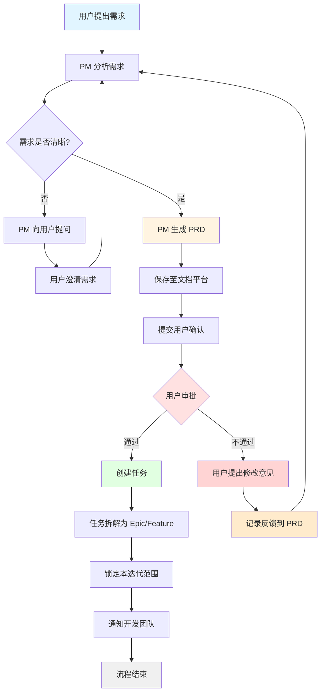
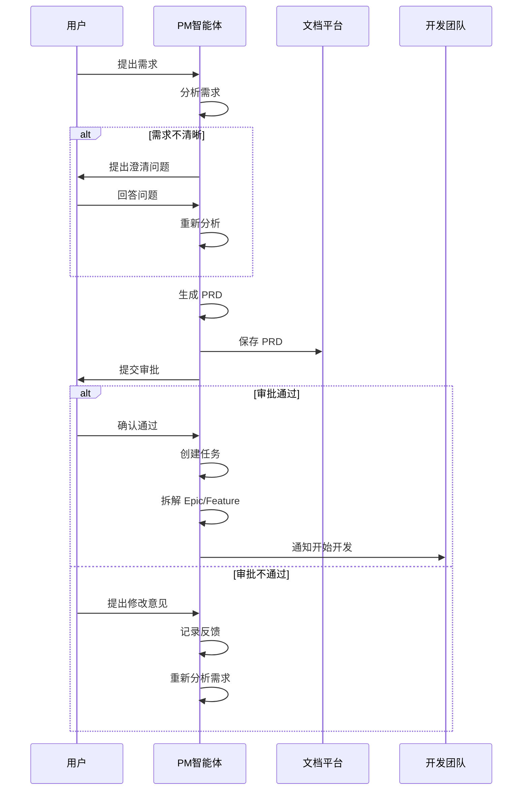
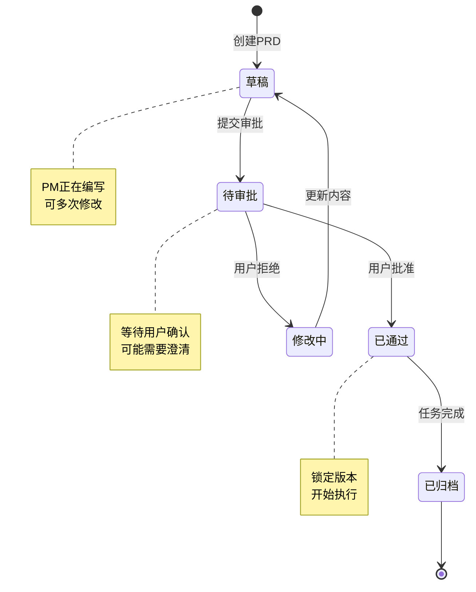
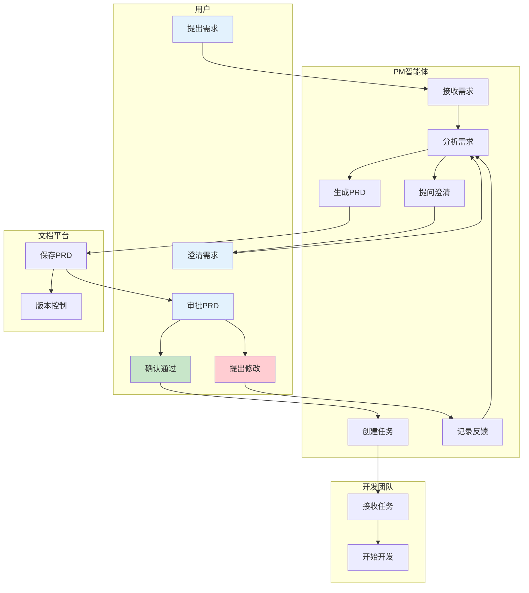
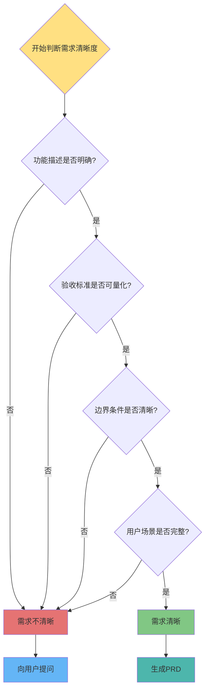
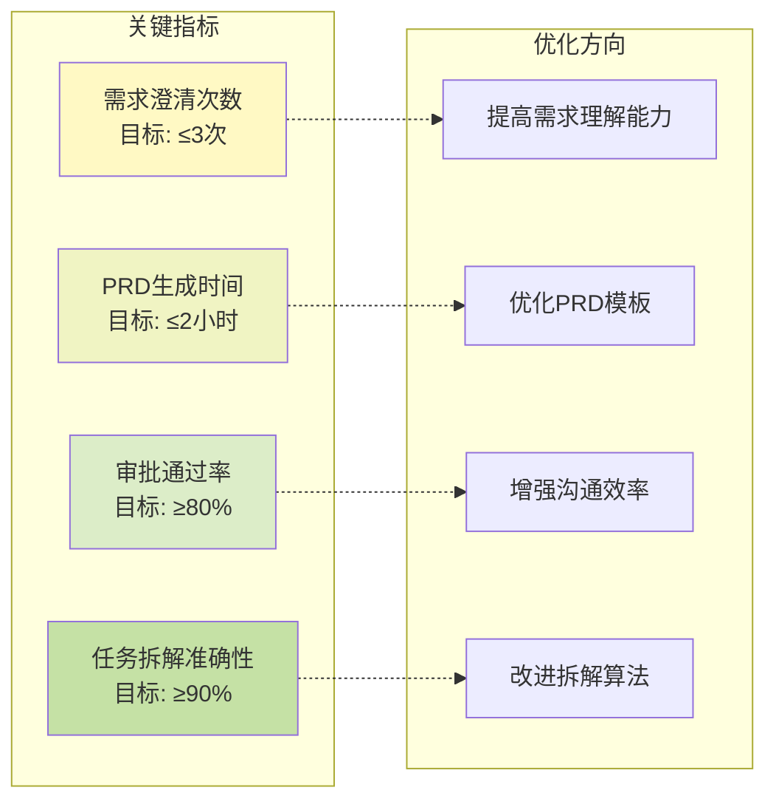

# PM 智能体工作流程图

## 流程总览图

## 详细流程图：完整工作流程

**说明**：
- 🔵 浅蓝色：流程起点（用户提出需求）
- 🟡 浅黄色：关键生成节点（PRD 生成）
- 🔴 浅红色：决策节点（用户审批）
- 🟢 浅绿色：审批通过路径（创建任务）
- 🟠 橙色：审批不通过路径（修改意见、记录反馈）
- ⚪ 灰色：流程结束

## 时序图：PM 与用户交互

## 状态图：PRD 文档状态流转

## 泳道图：跨角色协作流程

## 决策树：需求清晰度判断

## 流程性能指标图

## 使用说明

### 如何查看这些图表

1. **在 GitHub 上查看**：直接打开此 Markdown 文件，GitHub 会自动渲染 Mermaid 图
2. **在 VS Code 中查看**：安装 "Markdown Preview Mermaid Support" 插件
3. **在 Notion 中查看**：复制代码块到支持 Mermaid 的页面
4. **在线工具**：访问 [Mermaid Live Editor](https://mermaid.live/) 粘贴代码

### 图表说明

- **流程总览图**：整体流程的鸟瞰图
- **详细流程图**：两个分支流程的完整展示
- **时序图**：展示各角色之间的交互时间线
- **状态图**：PRD 文档的生命周期
- **泳道图**：跨团队协作的职责划分
- **决策树**：需求清晰度的判断逻辑
- **性能指标图**：关键指标与优化方向

---

**创建日期**：2026年3月7日  
**版本**：v1.0

