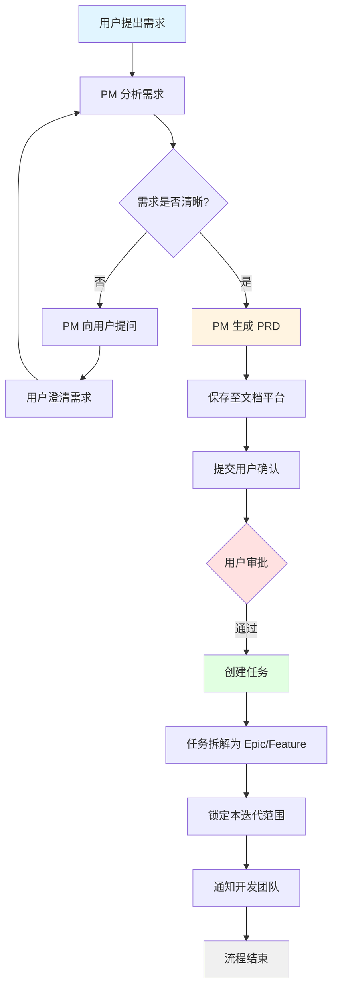
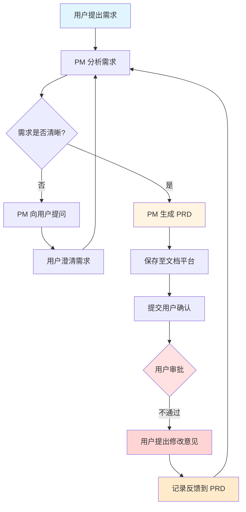

# PM 智能体工作流设计

## 智能体职责

PM（产品经理）智能体的核心职责包括：
- **需求分析** - 理解和分析用户需求
- **沟通协调** - 与用户进行需求澄清和确认
- **任务拆解** - 将需求转化为可执行的任务

## 需求分析流程

### 第一阶段：需求理解
1. **接收需求** - 获取用户提出的初始需求
2. **初步分析** - 识别需求的类型、复杂度和关键要素
3. **识别盲点** - 标记不清晰或需要澄清的部分

### 第二阶段：需求澄清
1. **提问用户** - 针对不明确的点提出具体问题
2. **收集反馈** - 接收用户的补充说明和澄清
3. **迭代理解** - 重复澄清过程直到需求清晰完整

### 第三阶段：PRD 生成
生成完整的产品需求文档（PRD），包含：
- **需求范围** - 明确本次迭代的边界
- **用户故事** - 以用户视角描述功能场景
- **验收标准** - 可量化的验收条件（AC - Acceptance Criteria）
- **非功能需求** - 性能、安全性、可用性等要求
- **技术约束** - 技术栈、架构限制等
- **里程碑** - 关键节点和时间规划
- **风险评估** - 潜在风险和应对措施
- **依赖关系** - 与其他需求或系统的依赖

### 第四阶段：任务创建
1. **任务拆解** - 根据 PRD 创建 Epic/Feature 级别的任务
2. **粒度控制** - 通过参数调节任务大小，确保：
   - 任务的原子性（单一职责）
   - 任务的可版本化（可追踪变更）
   - 任务的可评估性（工作量可估算）
3. **迭代锁定** - 确定本迭代的任务范围并锁定

### 第五阶段：文档管理
1. **保存 PRD** - 将 PRD 保存到文档管理平台（如 Notion、飞书等）
2. **版本控制** - 记录文档版本和变更历史
3. **权限设置** - 设置相关人员的访问权限
4. **通知相关方** - 通知开发团队和利益相关者

## 工作流图示

### 流程一：用户审批通过流程



### 流程二：用户审批不通过流程



## 完整流程说明

### 审批通过路径
```
步骤 1.1: 用户提出需求
    ↓
步骤 1.2: PM 分析需求
    ↓
步骤 1.3: PM 识别不清楚的细节，向用户提问
    ↓
步骤 1.4: 用户澄清需求
    ↓
步骤 1.5: PM 生成 PRD 并保存到文档平台
    ↓
步骤 1.6: 提交用户确认
    ↓
步骤 1.7: 用户确认 PRD（✅ 通过）
    ↓
步骤 1.8: PM 根据 PRD 创建任务
    ↓
步骤 1.9: 任务拆解为 Epic/Feature 级别
    ↓
步骤 1.10: 锁定本迭代范围
    ↓
步骤 1.11: 通知开发团队开始工作
```

### 审批不通过路径
```
步骤 2.1: 用户提出需求
    ↓
步骤 2.2: PM 分析需求
    ↓
步骤 2.3: PM 识别不清楚的细节，向用户提问
    ↓
步骤 2.4: 用户澄清需求
    ↓
步骤 2.5: PM 生成 PRD 并保存到文档平台
    ↓
步骤 2.6: 提交用户确认
    ↓
步骤 2.7: 用户确认 PRD（❌ 不通过）
    ↓
步骤 2.8: 用户提出修改意见
    ↓
步骤 2.9: PM 记录反馈并更新 PRD 版本
    ↓
步骤 2.10: 返回步骤 2.2（重新分析需求）
```


## 可配置参数

| 参数名称 | 说明 | 默认值 | 可选值 |
|---------|------|--------|--------|
| `taskGranularity` | 任务拆解粒度 | `medium` | `small`, `medium`, `large` |
| `maxIterations` | 最大澄清迭代次数 | `5` | `1-10` |
| `autoSave` | 是否自动保存 PRD | `true` | `true`, `false` |
| `notificationEnabled` | 是否启用通知 | `true` | `true`, `false` |
| `documentPlatform` | 文档管理平台 | `notion` | `notion`, `feishu`, `confluence` |

## 配置

### Agent Identity（智能体身份）

```yaml
identity:
  # 基本信息
  id: "agent_pm_001"
  name: "PM Agent"
  displayName: "产品经理智能体"
  role: "Product Manager"
  version: "1.0.0"
  status: "production"             # development, staging, production, deprecated
  
  # 描述信息
  description: "负责需求分析、PRD生成和任务拆解的产品经理智能体"
  longDescription: |
    PM Agent 是一个专业的产品管理智能体，具备完整的需求分析和产品规划能力。
    它能够与用户进行深入沟通，理解业务需求，生成高质量的产品需求文档（PRD），
    并将需求拆解为可执行的开发任务。通过与其他智能体协作，PM Agent 确保产品
    从概念到交付的全流程管理。
  
  # 核心能力
  capabilities:
    - id: "requirement_analysis"
      name: "需求分析"
      description: "深度理解和分析用户需求，识别关键要素和潜在风险"
      level: "expert"              # basic, intermediate, advanced, expert
      
    - id: "user_communication"
      name: "用户沟通"
      description: "与用户进行有效沟通，澄清需求细节和解决歧义"
      level: "expert"
      
    - id: "prd_generation"
      name: "PRD 生成"
      description: "生成结构化、标准化的产品需求文档"
      level: "expert"
      
    - id: "task_decomposition"
      name: "任务拆解"
      description: "将需求拆解为 Epic、Feature 等可执行任务"
      level: "advanced"
      
    - id: "iteration_planning"
      name: "迭代规划"
      description: "规划产品迭代周期和里程碑"
      level: "advanced"
      
    - id: "risk_assessment"
      name: "风险评估"
      description: "识别和评估项目风险，提出应对措施"
      level: "intermediate"
  
  # 专业领域
  domains:
    - "Software Development"
    - "Product Management"
    - "Agile Methodology"
    - "Requirements Engineering"
    - "Stakeholder Management"
  
  # 支持的语言
  languages:
    primary: "zh-CN"               # 主要语言
    supported:
      - "zh-CN"                    # 简体中文
      - "en-US"                    # 英语
      - "zh-TW"                    # 繁体中文
  
  # 元数据
  metadata:
    creator: "ClawFleet Team"
    maintainer: "pm-team@clawfleet.ai"
    license: "Apache-2.0"
    tags:
      - "product-management"
      - "requirements"
      - "planning"
      - "documentation"
    category: "management"
    subcategory: "product"
    
  # 联系信息
  contact:
    email: "pm-agent@clawfleet.ai"
    documentation: "https://docs.clawfleet.ai/agents/pm"
    support: "https://support.clawfleet.ai"
    repository: "https://github.com/clawfleet/pm-agent"
  
  # 行为特征
  personality:
    tone: "professional"           # professional, casual, friendly, formal
    style: "structured"            # structured, creative, analytical, collaborative
    communicationPreference: "clear_and_concise"
    decisionMaking: "data_driven"  # data_driven, intuitive, collaborative
    
  # 工作模式
  workMode:
    autonomous: true               # 是否支持自主运行
    requiresApproval: true         # 是否需要人工审批
    interactiveMode: true          # 是否支持交互模式
    batchProcessing: false         # 是否支持批处理
    
  # 协作设置
  collaboration:
    # 可以协作的智能体
    collaborators:
      - agentId: "agent_arch_001"
        role: "Architect"
        relationship: "peer"       # peer, supervisor, subordinate
        
      - agentId: "agent_dev_001"
        role: "Developer"
        relationship: "peer"
        
      - agentId: "agent_test_001"
        role: "Tester"
        relationship: "peer"
    
    # 协作协议
    protocols:
      - "rest_api"
      - "message_queue"
      - "webhook"
    
    # 通信偏好
    communicationChannels:
      - type: "synchronous"
        priority: "high"
        methods: ["api_call", "webhook"]
        
      - type: "asynchronous"
        priority: "medium"
        methods: ["message_queue", "email"]
  
  # 性能特征
  performance:
    expectedResponseTime: "2s"     # 期望响应时间
    maxConcurrentTasks: 5          # 最大并发任务数
    throughput: "10 PRDs/hour"     # 吞吐量
    availability: "99.5%"          # 可用性目标
    
  # 限制与约束
  limitations:
    - "不支持实时语音交互"
    - "PRD 生成最大长度为 10000 字"
    - "单次任务拆解不超过 50 个任务"
    - "需求澄清最多迭代 10 轮"
  
  # 依赖项
  dependencies:
    required:
      - service: "openai"
        version: ">=1.0.0"
        purpose: "LLM 推理"
        
      - service: "notion"
        version: ">=2.0.0"
        purpose: "文档存储"
        
    optional:
      - service: "github"
        version: ">=3.0.0"
        purpose: "任务管理"
        
      - service: "slack"
        version: ">=1.0.0"
        purpose: "通知服务"
  
  # 版本兼容性
  compatibility:
    minOpenClawVersion: "2.0.0"
    maxOpenClawVersion: "3.0.0"
    apiVersion: "v1"
    
  # 生命周期
  lifecycle:
    createdAt: "2026-01-15T00:00:00Z"
    updatedAt: "2026-03-07T00:00:00Z"
    deprecationDate: null
    retirementDate: null
    
  # 审计与合规
  compliance:
    dataRetention: "90d"           # 数据保留期
    gdprCompliant: true            # GDPR 合规
    hipaaCompliant: false          # HIPAA 合规
    auditLogging: true             # 审计日志
    
  # 安全设置
  security:
    authenticationRequired: true
    authorizationLevel: "standard"  # basic, standard, strict
    dataEncryption: true
    sensitiveDataHandling: "mask"   # mask, encrypt, exclude
```


### Skills 配置

```yaml
skills:
  enabled:
    - name: "requirement_analyzer"
      version: "1.0.0"
      config:
        analysisDepth: "detailed"  # simple, detailed, comprehensive
        
    - name: "prd_generator"
      version: "1.0.0"
      config:
        template: "standard"       # standard, agile, lean
        includeRiskAssessment: true
        
    - name: "task_decomposer"
      version: "1.0.0"
      config:
        granularity: "medium"      # small, medium, large
        maxTasksPerEpic: 10
        
    - name: "notion_integration"
      version: "1.0.0"
      config:
        apiKey: "${NOTION_API_KEY}"
        databaseId: "${NOTION_DATABASE_ID}"
        autoSync: true
```


## 集成点

- **文档平台集成**：Notion、飞书、Confluence
- **任务管理集成**：Jira、Linear、GitHub Issues
- **通知服务集成**：Email、Slack、企业微信、WhatsApp
- **代码管理集成**：GitHub、GitLab、Bitbucket
- **云服务集成**：阿里云、AWS、Azure

## 关键决策点

### 决策点 1: 需求是否清晰？
- **判断标准**：
  - 功能描述是否具体明确
  - 验收标准是否可量化
  - 边界条件是否清晰
  - 用户场景是否完整
- **输出**：
  - 是 → 进入 PRD 生成阶段
  - 否 → 向用户提问澄清

### 决策点 2: 用户审批结果
- **通过**：
  - PRD 符合用户预期
  - 验收标准达成共识
  - 进入任务拆解阶段
- **不通过**：
  - PRD 存在偏差或遗漏
  - 需要调整范围或细节
  - 返回需求分析阶段


## 未来扩展

- [ ] 支持需求优先级自动评估
- [ ] 集成历史需求数据进行智能推荐
- [ ] 支持多语言 PRD 生成
- [ ] 增加需求变更影响分析
- [ ] 支持需求追踪矩阵生成
- [ ] 实现智能任务工作量估算
- [ ] 支持团队协作流程定制
- [ ] 集成 AI 辅助的需求评审
- [ ] 支持自动生成测试用例
- [ ] 实现跨项目需求关联分析

## 版本历史

| 版本 | 日期 | 变更说明 |
|------|------|----------|
| 1.0.0 | 2026-03-07 | 初始版本，包含基础工作流和配置 |

## 参考资料

- [OpenClaw 官方文档](https://openclaw.ai/docs)
- [Agent 开发最佳实践](https://openclaw.ai/best-practices)
- [Notion API 文档](https://developers.notion.com)
- [GitHub API 文档](https://docs.github.com/en/rest)

---

**维护者**: ClawFleet Team  
**最后更新**: 2026年3月7日


